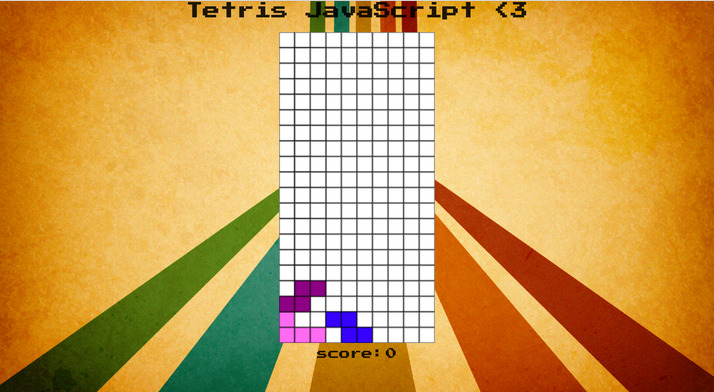
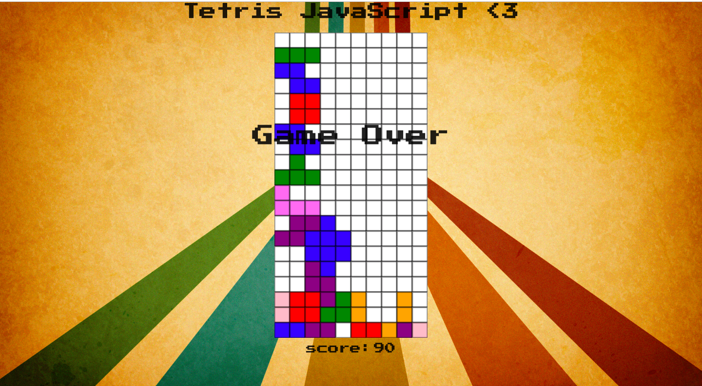
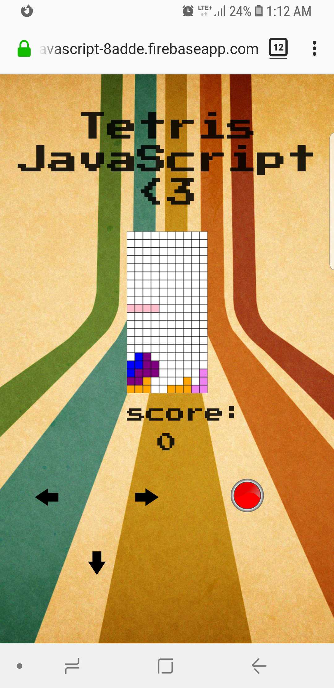
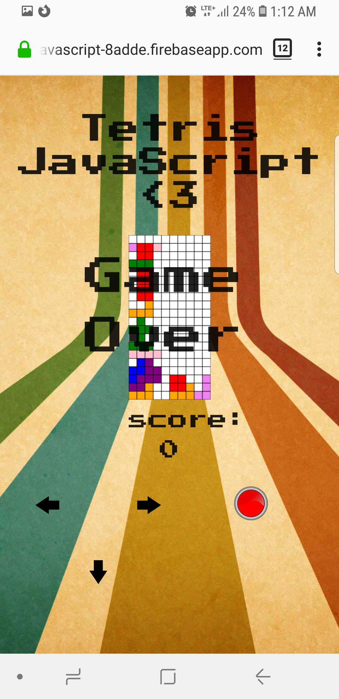

Tetris-JavaScript :heart:

### [Link to live site](https://tetrisjavascript-8adde.firebaseapp.com/)

___

## Minimum Viable Product
___
Users will be able to play a game of tetris on desktop or mobile devices. Application switches to mobile controls when detects appropriate screen size.
- App has responsive design for all platforms
___
## Desktop Version

- user can play tetris using arrow keys to move tetriminos and either the space bar, up arrow or the z key to rotate tetriminos

- Game is over when tetriminos touch the top of the grid

___

## Mobile Version (Responsive Design)

- when web app is opened on mobile device, a game controller appears and user is able to interact with controller to play Tetris

- same rules apply. When a Tetrimino touches the top of the grid, the game is over.

___

:heart: Jonathan